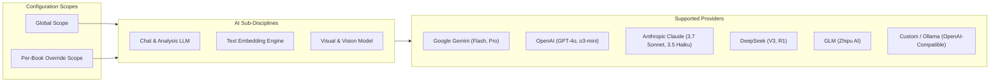

# Database Schema & AI Architecture

## 1. SQLite Database Schema (`internal/db/schema.sql`)

All database structures are created via pure SQL. The system uses WAL mode (`PRAGMA journal_mode=WAL; PRAGMA foreign_keys=ON;`) for high concurrency and data integrity.

### Tables

1. **`books`**:
   * Stored metadata for imported EPUB books (`id`, `title`, `author`, `description`, `publisher`, `language`, `cover_path`, `source_file_path`, `total_chapters`, `total_paragraphs`, `created_at`, `updated_at`).
2. **`chapters`**:
   * Chapters extracted from EPUB spines (`id`, `book_id`, `chapter_index`, `title`, `file_path`, `paragraph_count`, `created_at`).
3. **`paragraphs`**:
   * Granular paragraph units for deep reading (`id`, `book_id`, `chapter_index`, `paragraph_index`, `file_path`, `content_preview`, `created_at`).
4. **`reading_progress`**:
   * Active position tracking per book (`book_id`, `current_chapter_index`, `current_paragraph_index`, `percent_complete`, `last_read_at`).
5. **`settings`**:
   * Key-value configuration store for serialized JSON settings (`key`, `value`, `updated_at`).
6. **`paragraph_embeddings`**:
   * Vector embeddings for semantic search (`id`, `paragraph_id`, `book_id`, `embedding BLOB`, `dimensions`, `model`, `created_at`).
7. **`prompts`**:
   * Dynamic prompt definitions for the reader analysis toolbar:
     * `id TEXT PRIMARY KEY`
     * `name TEXT NOT NULL`
     * `description TEXT NOT NULL DEFAULT ''`
     * `icon TEXT NOT NULL DEFAULT 'Sparkles'`
     * `color_palette TEXT NOT NULL DEFAULT 'ruby'`
     * `system_prompt TEXT NOT NULL DEFAULT ''`
     * `user_prompt TEXT NOT NULL`
     * `provider TEXT NOT NULL DEFAULT ''` (empty = inherits active provider)
     * `model TEXT NOT NULL DEFAULT ''` (empty = inherits active model)
     * `temperature REAL NOT NULL DEFAULT 0.7`
     * `max_tokens INTEGER NOT NULL DEFAULT 2048`
     * `is_builtin INTEGER NOT NULL DEFAULT 0`
     * `is_enabled INTEGER NOT NULL DEFAULT 1`
     * `sort_order INTEGER NOT NULL DEFAULT 0`
     * `scope TEXT NOT NULL DEFAULT 'global'`
     * `book_id TEXT NOT NULL DEFAULT ''`
     * `created_at DATETIME NOT NULL DEFAULT CURRENT_TIMESTAMP`
     * `updated_at DATETIME NOT NULL DEFAULT CURRENT_TIMESTAMP`

---

## 2. Default Prompts Seeding via `sqlc` (`internal/db/queries.sql`)

All default prompts are seeded directly by `sqlc` during startup (`SeedDefaultPrompts`), strictly in **English**:

| Prompt ID | Name | Icon | Palette | Purpose |
| :--- | :--- | :--- | :--- | :--- |
| `explain_nuance` | Explain Nuance | `Sparkles` | `ruby` | Analyzes literary nuance, tone, and subtext. |
| `quick_summary` | Quick Summary | `Zap` | `amber` | Generates a punchy 2-3 sentence executive takeaway. |
| `vocab_idioms` | Vocabulary & Idioms | `BookOpen` | `teal` | Deconstructs challenging vocabulary, metaphors, and archaic idioms. |
| `literary_critique`| Literary Critique | `Glasses` | `indigo` | Analyzes author voice, rhythm, pacing, and narrative craft. |

Supported prompt template variables:
- `{text}`: Injects the active paragraph text.
- `{context}`: Injects surrounding chapter and narrative context.

---

## 3. Multi-Provider AI Architecture

Periodus supports global and per-book overrides across three separate AI model categories:

1. **Chat & Text Analysis**:
   * Powers paragraph explanation, summaries, translation, and user-defined prompts.
   * Configurable temperature, max tokens, custom endpoints (for local Ollama/LM Studio models).
2. **Text Embedding**:
   * Powers offline/online vector generation stored in `paragraph_embeddings`.
   * Configurable vector dimensions (e.g. 768, 1536).
3. **Visual & Vision**:
   * Reserved for image-to-text, figure analysis, diagram breakdown, and illustrated EPUB comprehension.
4. **Prompt Management**:
   * Fully customizable: add new prompts, edit system prompts and templates, change Lucide icons and Chakra color palettes, toggle enabled status, or reset to defaults.
