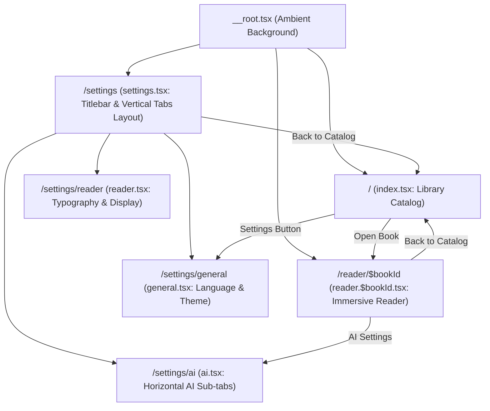

# Codebase Anatomy & Directory Structure

This document details the file organization, layer boundaries, and route tree of the Periodus repository.

---

## 1. Directory Tree

```
Periodus/
├── cmd/                          # Optional CLI or migration utilities
├── internal/                     # Go Backend Packages (Private)
│   ├── config/                   # Path resolution (%APPDATA%/Periodus), books/covers dirs
│   ├── db/                       # Database layer
│   │   ├── schema.sql            # SQLite DDL tables, indexes, constraints
│   │   ├── queries.sql           # sqlc query definitions & default prompt seeding
│   │   ├── models.go             # Auto-generated sqlc model structs
│   │   ├── querier.go            # Auto-generated sqlc Querier interface
│   │   ├── queries.sql.go        # Auto-generated sqlc database methods
│   │   ├── migration.go          # Additive schema evolution (ALTER TABLE on legacy DBs)
│   │   ├── prompt_queries.go     # Repository delegation to sqlc for Prompts
│   │   ├── repository.go         # Core Repository struct & connection lifecycle
│   │   ├── repository_test.go    # DB & migration unit tests
│   │   ├── settings_helpers.go   # JSON marshaling helpers for complex settings
│   │   └── types.go              # DTOs for JSON settings (ModelConfig, AISettings, etc.)
│   ├── dictionary/               # Princeton WordNet dictionary loader & lookup
│   ├── epub/                     # EPUB extraction, chapter chunking, paragraph parsing
│   ├── llm/                      # Multi-provider LLM provider abstractions (Genkit)
│   ├── openlibrary/              # OpenLibrary API client for book covers & metadata
│   └── service/                  # Wails v3 exported services
│       ├── book_service.go       # Book import, listing, deletion
│       ├── reader_service.go     # Chapters, paragraphs, reading progress
│       ├── ai_service.go         # Dynamic AI analysis execution
│       ├── settings_service.go   # App settings & prompt persistence
│       └── dictionary_service.go # WordNet dictionary lookups
├── ui/                           # Frontend Single-Page Application (React 19 + Vite)
│   ├── src/
│   │   ├── bindings/             # Auto-generated Wails v3 TypeScript bindings
│   │   ├── components/           # Component library organized by domain
│   │   │   ├── common/           # Ambient aura, grid, header, window controls
│   │   │   ├── library/          # Catalog shelf, book cards, empty placeholder
│   │   │   ├── reader/           # Paragraph reader, top nav, sticky controls, AI panel
│   │   │   └── settings/         # Settings modals, form fields, prompt editor
│   │   │       └── prompts/      # Icon picker, color picker, template chips, prompt cards
│   │   ├── hooks/                # Custom React hooks (subhooks for reader, library, AI)
│   │   ├── i18n/                 # Localization dictionaries (en, id, fr, de, la, nl, es, ja)
│   │   ├── lib/                  # Runtime utilities, types, bindings bridge, query client
│   │   ├── queries/              # TanStack Query hooks (books, reader, settings)
│   │   ├── routes/               # TanStack Router File-Based Route Tree
│   │   │   ├── __root.tsx        # Application root layout with Ambient background
│   │   │   ├── index.tsx         # Library / Catalog page (`/`)
│   │   │   ├── reader.$bookId.tsx# Reader page (`/reader/$bookId`)
│   │   │   ├── settings.tsx      # Settings Layout with window header & vertical nav
│   │   │   └── settings/
│   │   │       ├── index.tsx     # Redirects to /settings/general
│   │   │       ├── general.tsx   # General settings (Language & Theme)
│   │   │       ├── reader.tsx    # Reader typography & display settings
│   │   │       └── ai.tsx        # Multi-provider AI models & Prompt management
│   │   ├── state/                # Global Jotai atoms
│   │   ├── theme/                # Chakra UI v3 theme customization, tokens, layer styles
│   │   ├── App.tsx               # TanStack RouterProvider mount
│   │   ├── main.tsx              # React DOM entrypoint
│   │   └── routeTree.gen.ts      # Auto-generated route tree from @tanstack/router-plugin
│   ├── index.html
│   ├── package.json
│   └── vite.config.ts            # Vite config with TanStackRouterVite plugin
├── main.go                       # Wails v3 desktop entrypoint and service registration
├── sqlc.yaml                     # sqlc compilation rules
├── Taskfile.yml                  # Task runner configurations
└── README.md
```

---

## 2. Route Hierarchy & Navigation Flow


